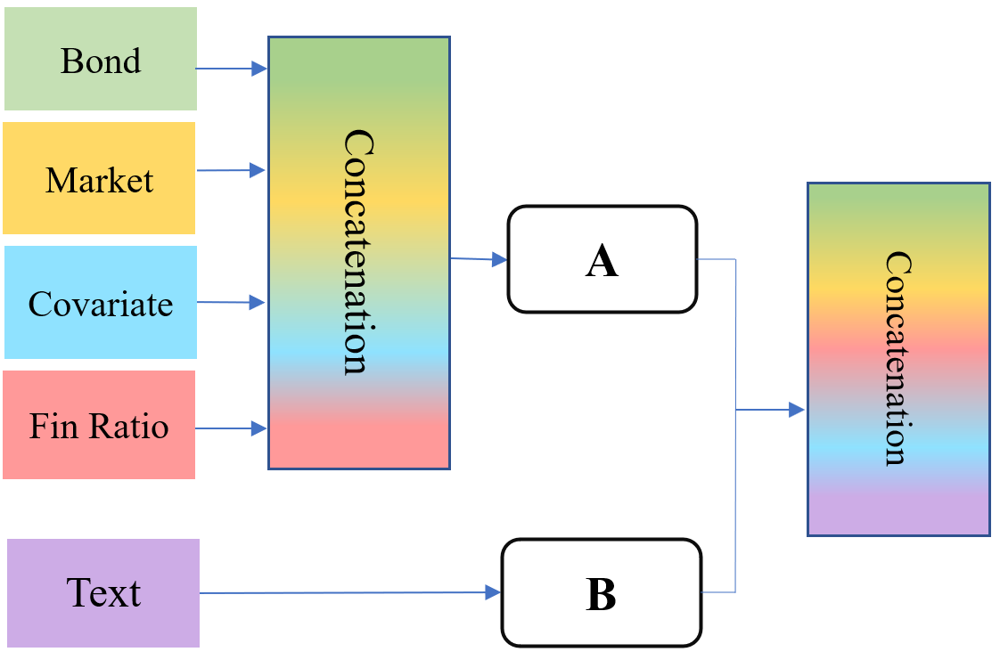
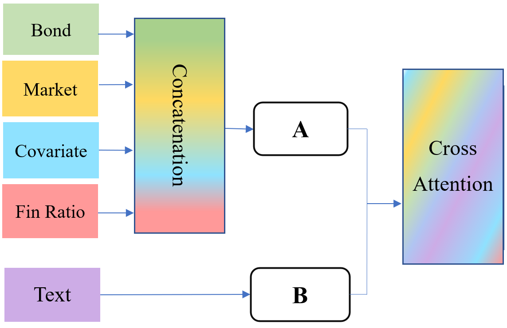
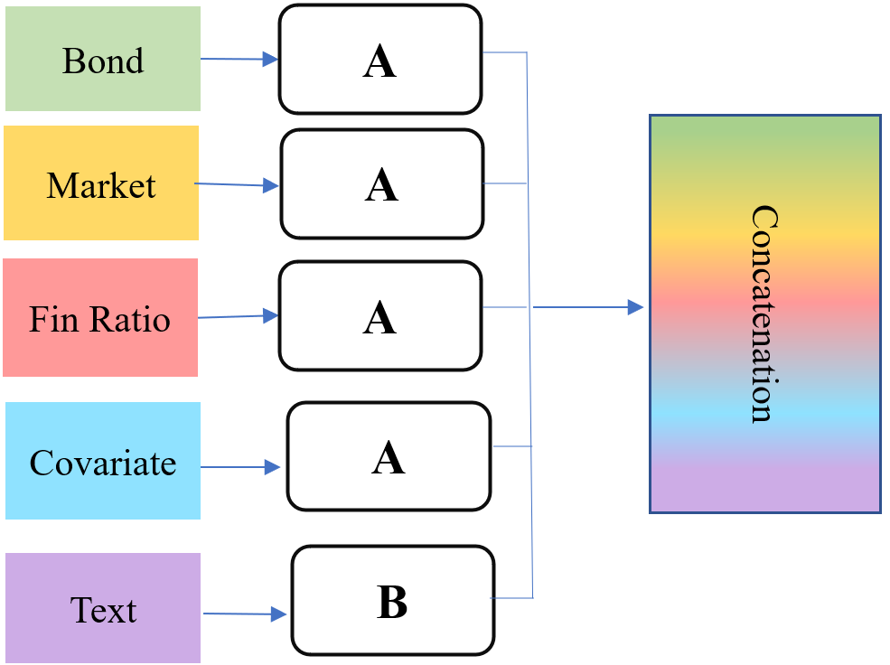
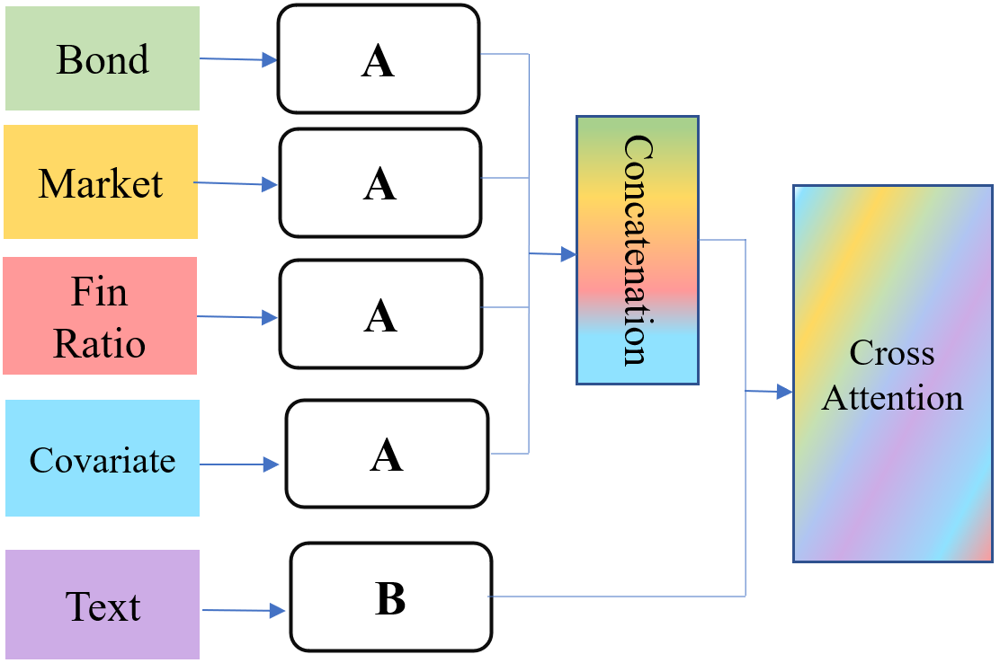

# MultimodalFusionRatings
Code for Tavakoli et al. (2023) paper on multimodal and information fusion strategies for credit rating modelling.

Abstract—Knowing which factors play a significant role in credit rating leads to better decision-making in financial applications including portfolio management. That is why in the last years this issue has been of interest to many researchers. However, in most of the research, the investigated features were mostly structured and therefore fewer studies have addressed unstructured or multi-modal datasets. Along with significant progress in the domain of Natural Language Processing, NLP, recent research in financial applications is involving text or a combination of various types of data which leads to presenting fusion strategies for mixing different modalities. In this paper, we discuss the different fusion strategies in terms of level (including signal and feature), and techniques (including concatenation and cross-attention). Consequently, we present 16 multimodal models for the prediction of company credit rating classes using four structured datasets including market, bond, financial ratios, and covariate information and one unstructured modality contains earning call transcripts. In these models, we combine different fusion strategies with well-known deep learning models, such as CNN, LSTM, GRU and transformers-based models. As a transformer-based model for unstructured modality, we use a state-of-art deep learning language model known as Bidirectional Encoder Representations from Transformers, BERT. As a result, we show that necessarily the most complex architectures do not have the highest performance. Out of all 16 models we introduce the best model, in which several CNN layers are combined with two fusion strategies, and do two robustness tests to make sure that the model is applicable in reality. Moreover, we investigate the contribution of each modality separately and show that the role of unstructured data significantly is the most. Then we provide a comparison of the impact of the different rating agencies on short/medium/long-term performance and indicate that credit rating prediction for the agency type of Moodi is more predictable, especially in the medium term. Finally, we discuss the impact of Covid19 crisis on this prediction and show that an unexpected crisis such as Covid19 can significantly affect the performance of models.

There are four groups of models: 

1-Group1:The signal fusion is used for the structured dataset. So, all numerical datasets are concatenated at the beginning, being prepared to enter network A to be trained. On the other hand, the text is trained using model B. Then feature fusion is utilized and the penultimate layer of different modalities is combined through the concatenation technique.

2-GROUP 2: Similar to GROUP 1 all numerical datasets are fused at the beginning (signal fusion) and then the concatenated numerical channel is sent to network A to be trained. The text channel is also sent to network B and their output layers are fused using the cross-attention technique

GROUP 3: Each numerical dataset separately passes through network A, and the text dataset entenetwork B, then their penultimate layers are concatenated. In this case, only the feature level of fusion is used.

GROUP 4: First, four numeric channels are trained separately by model A and the text channel is trained by model B. Then after training, the penultimate layer of numerical modalities is concatenated and finally, in the last step, we fuse the text layer and the concatenated layer via the cross-attention method.

